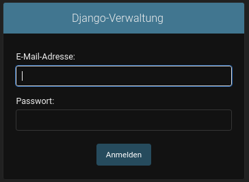

# Informationen für den Backend-Container
In dieser Datei wird behandelt, wie man den Container für die Backend-Funktionalitäten von MedPlanner nutzt. 

**Voraussetzung:** Das Projekt muss bereits mittels Docker Compose gestartet sein. Mehr dazu befindet sich in der zugehörigen [README.md](../README.md)

## Admin-Mode
Um eine graphische Darstellung für den Admin-Mode zu erhalten, muss Folgendes im Browser eingegeben werden:
```
http://localhost:8000/admin
```


Dort kann man sich dann mit den folgenden Credentials anmelden und Daten einpflegen:
+ admin_user: awe_user@admin.com
+ password: Z?D76.u(6756

### Probleme bei der Anmeldung
Falls es Schwierigkeiten beim Admin-Login gibt, ist vermutlich noch kein superuser erzeugt

**Ablauf für die Registrierung**
1. Über ein separates Terminal in diesem Ordner einen Admin registrieren:
```
docker exec -it sys-src_backend_1 python manage.py createsuperuser
```
2. Eingabe der erforderlichen Ferlder. Dabei können auch andere Credentials verwendet werden, beispielhaft jedoch die oben erwähnten:
```
E-Mail-Adresse: <admin_user>
Password: <password>
Password (again): <password>
```

**Anmerkung:** Der Default-User von Django verlangt eigentlich verpflichtend einen Benutzernamen statt einer Email-Adresse. Da wir bei der Registierung bzw. beim Login ausschließlich mit der E-Mail arbeiten, wurde das User Model entsprechend angepasst.

3. Danach sollte man wie gewohnt in den Admin-Mode gelangen können.

## Tests
Die Unit-Tests können über die Datei [test.sh](./test.sh) ausgeführt werden. Dabei werden Tests für die Models ausgeführt. Die Views werden nicht explizit über automatisierte Tests getestet: Im Frontend findet die Überprüfung der Funktionalität statt, indem Beispieldaten von Frontend zu Backend geschickt werden. Damit ist trotzdem gewährleistet, dass die Services funktionieren.

## Befehle
Generierung von SQL-Befehlen für die Datenbank jedoch ohne Ausführung!
```
docker exec sys-src_backend_1 python manage.py makemigrations
```

Einsehen der generierten SQL-Befehle Befehle 
```
docker exec sys-src_backend_1 python manage.py sqlmigrate medplanner <migration-filename>
```

Aktualisieren der Datenbank durch Ausführen von SQL-Befehlen
```
docker exec sys-src_backend_1 python manage.py migrate
```

Öffnen der Python-Shell, um über das Terminal Daten in die Datenbank einzufügen
```
docker exec sys-src_backend_1 python manage.py shell
```

## Weitere Informationen zu Django
* https://docs.djangoproject.com/en/3.2/intro/tutorial01/ 
* https://medium.com/shot-code/running-django-postgresql-containers-and-persisting-data-with-docker-4dd8e4dd5361
* https://docs.docker.com/samples/django/